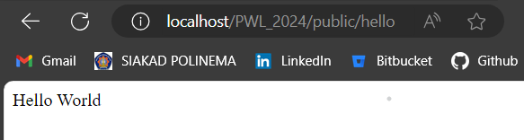
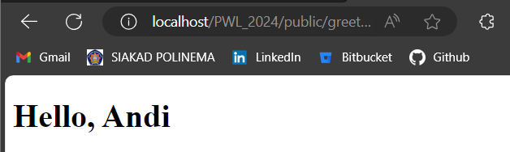

# Jobsheet 2: Routing, Controller, Dan View
> Nama  : Muhammad Fakhruddin Arif
> 
> Kelas : TI-2F
> 
> Nomor : 21

## Routing
### Basic Routing
- get:/hello

- get:/world

Halaman yang muncul sudah sesuai dengan return data tersebut

- get:/

  

- get:/about

### Route Parameters
- get:/user/{name}

Data yang muncul untuk {name} akan sesuai url yang kita input

- get:/posts/{post}/comments/{comment}

Halaman yang muncul yaitu akan ada tulisan Pos "Ke-1 Komentar Ke-5"

- get:/articles/{id}

### Optional Parameters
- get:/user/{name?} $name = null

Tidak akan ada nama yang muncul karena bersifat NULL

- get:/user/{name?} $name = "John"

Jika data tidak diisi maka akan muncul nama "John"

## Controller
### Create Controller
- get:/hello

Akan muncul kalimat "Hello World"

- get:/

- get:/about

- get:/articles/{id}

### Resource Controller

## View
### Create View

### View dalam direktori
Data akan sama yang keluar adalah "Hello, Andi" karena cuma memindah file ke dalam folder blog

### Menampilkan View dari Controller
Data akan sama cuma perbedaan pada peletakan pada view didalam controller

### Meneruskan data ke view

Akan ada tambahan pada output yaitu occupation  pada hasil tampilan
